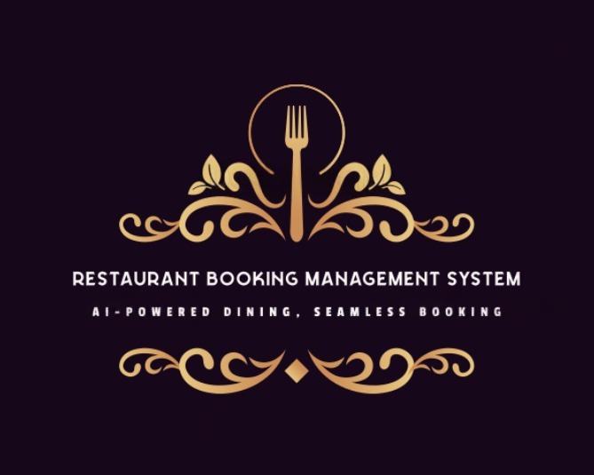
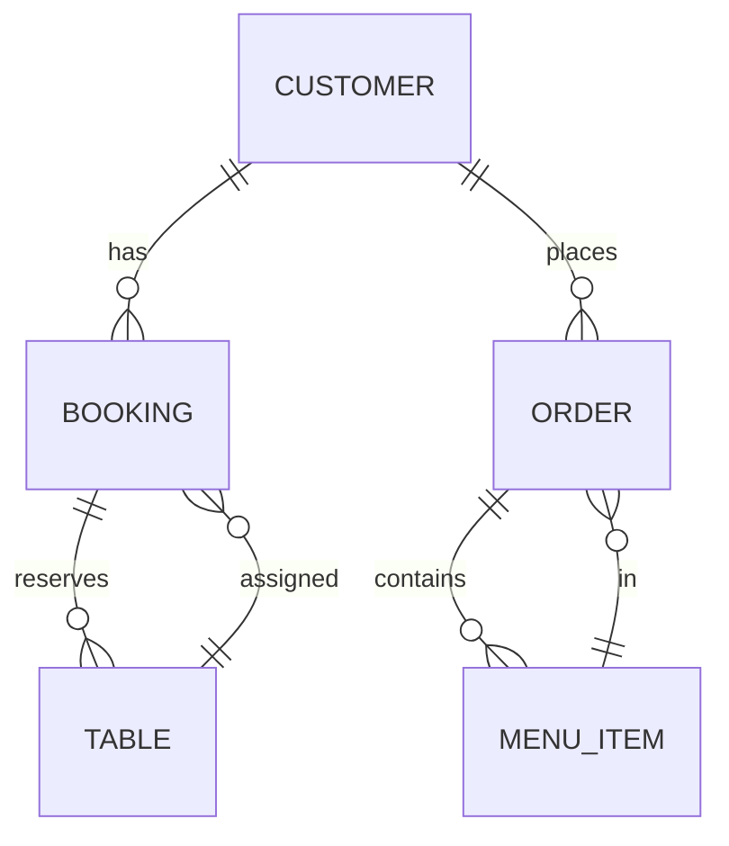

<div align="center" style="margin-top: 24px;">
  
  <h1 style="margin-top: 20px; font-family: 'Segoe UI', Arial, sans-serif; font-weight: bold; color: #fff; letter-spacing: 2px; text-align: center;">
    RESTAURANT BOOKING MANAGEMENT SYSTEM
  </h1>
</div>

<p align="center">
	<em>Hệ thống quản lý đặt bàn, thực đơn, đơn hàng nhà hàng tích hợp AI Agent tiếng Việt</em>
</p>
<p align="center">
	
	
	
	
</p>
<p align="center"><!-- default option, no dependency badges. -->
</p>
<p align="center">
	<!-- default option, no dependency badges. -->
</p>
<br>

## 🔗 Table of Contents

- [📍 Overview](#-overview)
- [👾 Features](#-features)
- [📁 Project Structure](#-project-structure)
  - [📂 Project Index](#-project-index)
- [🚀 Getting Started](#-getting-started)
  - [☑️ Prerequisites](#-prerequisites)
  - [⚙️ Installation](#-installation)
  - [🤖 Usage](#🤖-usage)
  - [🧪 Testing](#🧪-testing)
- [📌 Project Roadmap](#-project-roadmap)
- [🔰 Contributing](#-contributing)
- [🎗 License](#-license)
- [🙌 Acknowledgments](#-acknowledgments)

---

## 📍 Overview

**Restaurant Booking Management System** là hệ thống quản lý đặt bàn và dịch vụ nhà hàng thông minh, tích hợp AI Agent sử dụng ngôn ngữ tự nhiên tiếng Việt. Dự án kết hợp backend Java (theo mô hình MVC) và Python AI Agent (RAG + LLM) để tự động hóa các nghiệp vụ như đặt bàn, gợi ý món ăn, quản lý đơn hàng, chăm sóc khách hàng, và hỗ trợ quản lý nhà hàng.

---

##  Features

- Đặt bàn, kiểm tra bàn trống, quản lý booking
- Gợi ý món ăn, hiển thị thực đơn, tư vấn món phù hợp
- Quản lý đơn hàng, khách hàng, phản hồi
- Tích hợp AI Agent tiếng Việt (Gemini LLM, RAG)
- Tìm kiếm thông tin nhanh qua vector search
- Phân quyền, quản lý vai trò (user, manager)
- Giao tiếp tự nhiên qua console hoặc API

---

## 📁 Project Structure

```sh
└── RestaurantBookingManagement/
    ├── README.md
    ├── ai_agent
    │   ├── __init__.py
    │   ├── agent_permissions.json
    │   ├── agents
    │   ├── app.py
    │   ├── requirements.txt
    │   ├── tools.json
    │   └── tools_customer.json
    ├── build.xml
    ├── data
    │   ├── bookings.json
    │   ├── customers.json
    │   ├── knowledge
    │   ├── menu_items.json
    │   ├── orders.json
    │   └── tables.json
    ├── lib
    │   └── gson-2.10.1.jar
    ├── manifest.mf
    ├── nbproject
    ├── run_ai.bat
    ├── run_ai.sh
    ├── run_memory.bat
    └── src
        └── restaurantbookingmanagement
```

### 📂 Project Index
<details open>
	<summary><b><code>RESTAURANTBOOKINGMANAGEMENT/</code></b></summary>
	<details>
		<summary><b>ai_agent</b></summary>
		<blockquote>
			- Python AI Agent (RAG + LLM, Flask API)
			- Xử lý intent, routing, sinh phản hồi tự động
		</blockquote>
	</details>
	<details>
		<summary><b>src/restaurantbookingmanagement</b></summary>
		<blockquote>
			- Java Backend (MVC: Model, View, Controller)
			- Xử lý nghiệp vụ, lưu trữ dữ liệu, API
		</blockquote>
	</details>
	<details>
		<summary><b>data</b></summary>
		<blockquote>
			- Dữ liệu mẫu: menu, booking, khách hàng, bàn, đơn hàng
		</blockquote>
	</details>
</details>

---

## 🚀 Getting Started

### ☑️ Prerequisites

- **Java 8+**
- **Python 3.8+**
- **pip**

### ⚙️ Installation

1. Clone repository:
```sh
git clone https://github.com/blu1606/RestaurantBookingManagement
cd RestaurantBookingManagement
```
2. Cài đặt Python dependencies:
```sh
cd ai_agent
pip install -r requirements.txt
```
3. Build Java backend (NetBeans hoặc dòng lệnh):
```sh
# Mở project bằng NetBeans và build, hoặc:
cd ..
ant
```

### 🤖 Usage

- Chạy AI Agent (Python):
```sh
cd ai_agent
python app.py
```
- Chạy Java backend:
```sh
# Chạy từ NetBeans hoặc dòng lệnh:
cd src
# hoặc chạy file RestaurantBookingManagement.java
```

### 🧪 Testing

- Chạy test cho Python (nếu có):
```sh
cd ai_agent
pytest
```
- Chạy test cho Java (nếu có):
```sh
# Sử dụng NetBeans hoặc dòng lệnh
```

---

## 🧠 Giải thích về AI Agent, mô hình & luồng hoạt động

### 1. **AI Routing (RouterAI)**
- **RouterAI** là thành phần trung tâm chịu trách nhiệm phân tích ý định (intent) của người dùng và điều hướng (route) yêu cầu đến agent chuyên biệt phù hợp.
- **Cách hoạt động:**
  1. Nhận input tiếng Việt tự nhiên từ người dùng.
  2. Sử dụng mô hình Gemini LLM để phân tích ý định (intent classification) dựa trên prompt và ví dụ intent.
  3. Mapping intent sang agent chuyên biệt (ví dụ: intent "menu_recommendation" → MenuAgent).
  4. Trả về agent, intent, confidence cho AgentManager để xử lý tiếp.
- **Các intent chính:**
  - greeting: Chào hỏi, giới thiệu
  - menu_recommendation: Gợi ý món ăn, hỏi menu
  - booking: Đặt bàn, kiểm tra bàn trống
  - cancellation: Hủy bàn
  - order: Đặt món, kiểm tra đơn hàng
  - feedback: Góp ý, đánh giá
  - information: Hỏi thông tin nhà hàng
  - fallback: Xử lý câu hỏi ngoài phạm vi
- **Ví dụ routing:**
  - "Tôi muốn đặt bàn cho 2 người tối nay" → intent: booking → BookingAgent
  - "Có món phở không?" → intent: menu_recommendation → MenuAgent

### 2. **Luồng hoạt động tổng thể**

1. Người dùng nhập câu hỏi/nhu cầu tự nhiên (console hoặc API).
2. Java backend nhận request, chuyển tiếp tới Python AI Agent qua HTTP API.
3. AI Agent (RouterAI) phân tích intent, chọn agent chuyên biệt.
4. Agent chuyên biệt truy vấn dữ liệu (menu, booking, v.v.), sinh phản hồi tự động.
5. Kết quả trả về Java backend, hiển thị cho người dùng.

### 3. **Các mô hình & công nghệ AI**
- **Gemini LLM**: Xử lý ngôn ngữ tự nhiên, phân tích intent, sinh phản hồi.
- **RAG (Retrieval-Augmented Generation)**: Kết hợp truy vấn dữ liệu thực tế (menu, booking, knowledge) với LLM để trả lời chính xác, sát nghiệp vụ.
- **Vector Search (FAISS/Chroma)**: Tìm kiếm ngữ nghĩa nhanh trên tập tool/data.

### 4. **Design Pattern sử dụng**
- **MVC (Java backend):** Phân tách Model, View, Controller rõ ràng.
- **Agent Pattern (Python):** Mỗi nghiệp vụ là một agent chuyên biệt, quản lý bởi AgentManager.
- **Singleton (ToolDetector):** Đảm bảo chỉ có một instance quản lý tool embeddings.
- **Factory/Registry (AIActionHandlerRegistry):** Đăng ký và gọi handler động theo action.
- **Strategy (Routing):** RouterAI chọn chiến lược agent phù hợp theo intent.

---

## 🏗️ Sơ đồ kiến trúc hệ thống

```mermaid
graph TD
    subgraph Java Backend (MVC)
        A[Model]
        B[View]
        C[Controller]
    end
    subgraph Python AI Agent (RAG + LLM)
        D[BaseAgent]
        E[SpecializedAgents]
        F[ToolDetector]
        G[VectorDB]
        H[GeminiLLM]
        I[FlaskAPI]
    end
    Frontend -.->|HTTP API| I
    I <--> C
    C <--> A
    C <--> B
    I <--> D
    D <--> E
    D <--> F
    D <--> G
    D <--> H
```

---

## 🗂️ ERD (Entity Relationship Diagram)



---

## 👤 User Flow

1. Người dùng đăng nhập/đăng ký (nếu có)
2. Xem menu, hỏi món, nhận gợi ý từ AI
3. Đặt bàn, kiểm tra bàn trống
4. Đặt món, kiểm tra đơn hàng
5. Hủy bàn, gửi phản hồi
6. Nhận thông báo xác nhận, trạng thái qua console/API

---

## 📌 Project Roadmap

- [X] Đặt bàn, quản lý booking
- [X] Gợi ý món ăn, menu
- [X] Quản lý đơn hàng, khách hàng
- [X] Tích hợp AI Agent tiếng Việt
- [ ] Giao diện web/mobile
- [ ] Tích hợp thanh toán online
- [ ] Báo cáo, thống kê nâng cao

---

## 🔰 Contributing

Đóng góp ý kiến, pull request, hoặc báo lỗi qua GitHub Issues.

---

## 🎗 License

MIT License

---

## 🙌 Acknowledgments

- Gemini LLM, Google
- Chroma/FAISS VectorDB
- NetBeans, Flask, Python, Java
- Icons8 