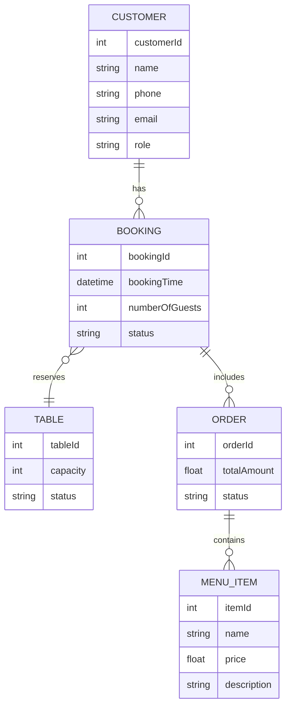

# Restaurant Booking Management System

## Mô tả dự án

**Restaurant Booking Management System** là hệ thống quản lý đặt bàn và dịch vụ nhà hàng thông minh, tích hợp AI Agent sử dụng ngôn ngữ tự nhiên tiếng Việt. Dự án kết hợp backend Java (theo mô hình MVC) và Python AI Agent (RAG + LLM) để tự động hóa các nghiệp vụ như đặt bàn, gợi ý món ăn, quản lý đơn hàng, chăm sóc khách hàng, và hỗ trợ quản lý nhà hàng.

---

## Kiến trúc hệ thống

```
┌───────────────────────┐    HTTP API     ┌─────────────────────────┐
│     Java Backend      │◀──────────────▶│   Python AI Agent       │
│       (MVC)           │                 │    (RAG + LLM)          │
│  • Model              │                 │  • FAISS/Chroma VectorDB│
│  • View               │                 │  • Gemini LLM           │
│  • Controller         │                 │  • Flask API            │
└───────────────────────┘                 └─────────────────────────┘
```

- **Java Backend**: Xử lý nghiệp vụ, lưu trữ dữ liệu, cung cấp API cho frontend và AI Agent.
- **Python AI Agent**: Hiểu ngôn ngữ tự nhiên, phân tích ý định, gợi ý, trả lời tự động, tích hợp LLM (Gemini).

---

## Hướng dẫn cài đặt

### 1. Cài đặt Python AI Agent

```bash
cd ai_agent
python -m venv venv
source venv/bin/activate  # Linux/Mac
# hoặc
venv\Scripts\activate     # Windows

pip install -r requirements.txt
```

- **Cấu hình Gemini API key**:
  - Đặt biến môi trường `GOOGLE_API_KEY` hoặc thêm vào file `.env` trong thư mục `ai_agent`.

```bash
export GOOGLE_API_KEY="your-gemini-api-key-here"
```

- **Chạy AI Agent**:
```bash
python app.py
```
- Truy cập API tại: `http://localhost:5000`

### 2. Cài đặt & chạy Java Backend

- Mở project trong NetBeans IDE.
- Build project (F11).
- Chạy file `RestaurantBookingManagement.java` (F6).

---

## Phụ thuộc

### Python (ai_agent/requirements.txt)
- flask==2.3.3
- flask-cors==4.0.0
- google-generativeai==0.3.2
- sentence-transformers
- numpy
- scikit-learn
- python-dotenv==1.0.0
- langchain-chroma==0.1.0
- langchain-core==0.1.0
- langchain-google-genai==0.0.6

### Java
- Java 11+
- Gson library (cho JSON parsing)

---

## Cách dùng & ví dụ

### Đặt bàn
```
> Tôi muốn đặt bàn 2 người tối nay
> Đặt bàn 4 người vào 7h tối mai
> Cần bàn 8 người cho bữa trưa
```
**AI sẽ hỏi thêm thông tin khách hàng nếu cần.**

### Gọi món
```
> Gợi ý cho tôi các món ăn mùa hè
> Cho tôi xem menu
> Tôi muốn gọi phở bò và trà đá
```

### Hủy đặt bàn, hỏi thông tin, quản lý đơn hàng
```
> Hủy đặt bàn số 5
> Xem các bàn còn trống
> Tính tiền cho booking 3
```

---

## Đặc điểm chính & Tính năng

- Hiểu ngôn ngữ tự nhiên tiếng Việt.
- Đặt bàn, gợi ý món ăn, quản lý đơn hàng, báo cáo doanh thu.
- Tích hợp AI Gemini LLM, vector search (RAG).
- Quản lý khách hàng, bàn, menu, đơn hàng, feedback.
- Phân quyền theo vai trò (user, staff, admin, manager).

---

## Giải thích về AI Agent, mô hình & luồng hoạt động

### 1. **AI Routing (RouterAI)**
- **RouterAI** là thành phần trung tâm chịu trách nhiệm phân tích ý định (intent) của người dùng và điều hướng (route) yêu cầu đến agent chuyên biệt phù hợp.
- **Cách hoạt động:**
  1. Nhận input tiếng Việt tự nhiên từ người dùng.
  2. Sử dụng mô hình Gemini LLM để phân tích ý định (intent classification) dựa trên prompt và ví dụ intent.
  3. Mapping intent sang agent chuyên biệt (ví dụ: intent "menu_recommendation" → MenuAgent).
  4. Trả về agent, intent, confidence cho AgentManager để xử lý tiếp.
- **Các intent chính:**
  - greeting: Chào hỏi, giới thiệu
  - menu_recommendation: Gợi ý món ăn, hỏi menu
  - booking: Đặt bàn, kiểm tra bàn trống
  - cancellation_modification: Hủy, sửa đặt bàn
  - restaurant_info: Hỏi thông tin nhà hàng
  - feedback: Góp ý, đánh giá
  - management: Quản lý đơn hàng, báo cáo
  - fallback: Không xác định, ngoài phạm vi
- **Ví dụ routing:**
  - "Tôi muốn đặt bàn 4 người tối nay" → intent: booking → BookingAgent
  - "Gợi ý cho tôi các món ăn mùa hè" → intent: menu_recommendation → MenuAgent
  - "Hủy đặt bàn số 5" → intent: cancellation_modification → CancellationAgent

### 2. **AI Agent (Python)**
- **BaseAgent**: Lớp trừu tượng cho mọi agent, quản lý knowledge base, vector DB, tool detection.
- **Specialized Agents**:
  - `GreetingAgent`: Chào hỏi, hướng dẫn.
  - `MenuAgent`: Gợi ý món ăn, show menu.
  - `BookingAgent`: Đặt bàn, kiểm tra bàn trống.
  - `OrderAgent`: Gọi món, tính tiền, quản lý đơn hàng.
  - `InformationAgent`: Thông tin nhà hàng, khách hàng.
  - `CancellationAgent`: Hủy đặt bàn.
  - `FallbackAgent`: Xử lý trường hợp không xác định.

### 3. **Mô hình AI & Tool Detection**
- **Gemini LLM**: Xử lý ngôn ngữ tự nhiên, sinh phản hồi, phân tích ý định.
- **ToolDetector**: Singleton, sử dụng embeddings (GoogleGenerativeAIEmbeddings) + cosine similarity để phát hiện tool phù hợp.
- **RAG (Retrieval-Augmented Generation)**: Kết hợp knowledge base (vector DB) và LLM để trả lời chính xác, có ngữ cảnh.

### 4. **Luồng hoạt động**
1. Người dùng nhập yêu cầu (tiếng Việt tự nhiên).
2. Flask API nhận request, chuyển cho AgentManager.
3. **RouterAI** phân tích ý định, chọn agent phù hợp.
4. Agent xử lý, truy vấn knowledge base, gọi LLM hoặc tool.
5. Nếu là action Java, trả về cho backend xử lý nghiệp vụ.
6. Trả kết quả cho người dùng.

---

## Design Patterns sử dụng

- **Singleton**: ToolDetector (đảm bảo chỉ có 1 instance, tiết kiệm tài nguyên).
- **Factory**: Khởi tạo các agent chuyên biệt.
- **Dependency Injection**: Java Service (OrderService, BookingService, ...).
- **State Pattern**: Quản lý trạng thái bàn (TableStatus, TableState).
- **MVC**: Java backend (Model-View-Controller).

---

## Sơ đồ kiến trúc tổng thể

```mermaid
graph TD
    subgraph Java Backend (MVC)
        A[Model]
        B[View]
        C[Controller]
    end
    subgraph Python AI Agent (RAG + LLM)
        D[BaseAgent]
        E[SpecializedAgents]
        F[ToolDetector]
        G[VectorDB]
        H[GeminiLLM]
        I[FlaskAPI]
    end
    Frontend -.->|HTTP API| I
    I <--> C
    C <--> A
    C <--> B
    I <--> D
    D <--> E
    D <--> F
    D <--> G
    D <--> H
```

---

## ERD (Entity Relationship Diagram)



---

## User Flow

1. **Đặt bàn**:  
   Người dùng → Nhập yêu cầu → AI hỏi thêm thông tin (nếu thiếu) → Xác nhận đặt bàn → Lưu vào database.

2. **Gọi món**:  
   Người dùng → Nhập món muốn gọi → AI xác nhận, kiểm tra menu → Thêm vào đơn hàng → Tính tiền.

3. **Hủy đặt bàn/đơn hàng**:  
   Người dùng → Nhập yêu cầu hủy → AI xác nhận → Backend cập nhật trạng thái.

4. **Xem thông tin, báo cáo**:  
   Người dùng/Quản lý → Nhập yêu cầu → AI/Backend trả về thông tin, báo cáo.

---

## Ví dụ sử dụng

### Đặt bàn
```
> Tôi muốn đặt bàn 4 người tối nay
AI: Vui lòng cho biết tên và số điện thoại để xác nhận đặt bàn.
```

### Gọi món
```
> Gợi ý cho tôi các món ăn mùa hè
AI: Gợi ý: Phở Bò Tái (ID: 101), Bún Chả Hà Nội (ID: 102), ...
```

### Hủy đặt bàn
```
> Hủy đặt bàn số 5
AI: Đã hủy đặt bàn #5 thành công.
```

---

**Chúc bạn sử dụng hệ thống hiệu quả!** 