<div align="center" style="margin-top: 24px;">
  
  <h1 style="margin-top: 20px; font-family: 'Segoe UI', Arial, sans-serif; font-weight: bold; color: #fff; letter-spacing: 2px; text-align: center;">
    RESTAURANT BOOKING MANAGEMENT SYSTEM
  </h1>
</div>

<p align="center">
	<em>Hệ thống quản lý đặt bàn, thực đơn, đơn hàng nhà hàng tích hợp AI Agent tiếng Việt</em>
</p>
<p align="center">
	
	
	
	
</p>
<p align="center"><!-- default option, no dependency badges. -->
</p>
<p align="center">
	<!-- default option, no dependency badges. -->
</p>
<br>

## 🔗 Table of Contents

- [📍 Overview](#-overview)
- [👾 Features](#-features)
- [📁 Project Structure](#-project-structure)
  - [📂 Project Index](#-project-index)
- [🚀 Getting Started](#-getting-started)
  - [☑️ Prerequisites](#-prerequisites)
  - [⚙️ Installation](#-installation)
  - [🤖 Usage](#🤖-usage)
  - [🧪 Testing](#🧪-testing)
- [📌 Project Roadmap](#-project-roadmap)
- [🔰 Contributing](#-contributing)
- [🎗 License](#-license)
- [🙌 Acknowledgments](#-acknowledgments)

---

## 📍 Overview

**Restaurant Booking Management System** là hệ thống quản lý đặt bàn và dịch vụ nhà hàng thông minh, tích hợp AI Agent sử dụng ngôn ngữ tự nhiên tiếng Việt. Dự án kết hợp backend Java (theo mô hình MVC) và Python AI Agent (RAG + LLM) để tự động hóa các nghiệp vụ như đặt bàn, gợi ý món ăn, quản lý đơn hàng, chăm sóc khách hàng, và hỗ trợ quản lý nhà hàng.

---

##  Features

- Đặt bàn, kiểm tra bàn trống, quản lý booking
- Gợi ý món ăn, hiển thị thực đơn, tư vấn món phù hợp
- Quản lý đơn hàng, khách hàng, phản hồi
- Tích hợp AI Agent tiếng Việt (Gemini LLM, RAG)
- Tìm kiếm thông tin nhanh qua vector search
- Phân quyền, quản lý vai trò (user, manager)
- Giao tiếp tự nhiên qua console hoặc API

---

## 📁 Project Structure

```sh
RestaurantBookingManagement/
├── README.md
├── ai_agent/                # Python AI Agent (RAG + LLM, Flask API)
│   ├── agents/              # Core, specialized agents, utils
│   ├── app.py               # Flask API entrypoint
│   ├── requirements.txt     # Python dependencies
│   ├── agent_permissions.json
│   ├── tools.json
│   └── tools_customer.json
├── build.xml                # Ant build file for Java
├── data/                    # Sample data (menu, bookings, customers, etc.)
│   ├── bookings.json
│   ├── customers.json
│   ├── menu_items.json
│   ├── orders.json
│   ├── tables.json
│   └── knowledge/           # Knowledge base for fallback, greeting, info
├── lib/                     # Java libraries (e.g., gson)
│   └── gson-2.10.1.jar
├── manifest.mf
├── nbproject/               # NetBeans project config
├── run_ai.bat / run_ai.sh   # Scripts to run AI agent
├── run_memory.bat
└── src/
    └── restaurantbookingmanagement/
        ├── ai/             # Java-AI connector, handlers
        ├── controller/     # Java MVC controllers
        ├── model/          # Java data models (Booking, Customer, etc.)
        ├── service/        # Business logic, file services, validators
        ├── utils/          # Utility classes
        └── view/           # Console view, DTOs
```

**Chú thích:**
- `ai_agent/`: Toàn bộ mã nguồn Python AI Agent, xử lý ngôn ngữ tự nhiên, intent, routing, sinh phản hồi.
- `src/restaurantbookingmanagement/`: Mã nguồn Java backend, theo mô hình MVC, quản lý nghiệp vụ, dữ liệu, API.
- `data/`: Dữ liệu mẫu cho menu, booking, khách hàng, đơn hàng, bàn.
- `lib/`: Thư viện Java bên ngoài.
- `nbproject/`: Cấu hình NetBeans IDE.
- `run_ai.bat`, `run_ai.sh`: Script chạy AI agent nhanh.

---

### 📂 Project Index
<details open>
	<summary><b><code>RESTAURANTBOOKINGMANAGEMENT/</code></b></summary>
	<details> <!-- __root__ Submodule -->
		<summary><b>__root__</b></summary>
		<blockquote>
			<table>
			<tr>
				<td><b><a href='https://github.com/blu1606/RestaurantBookingManagement/blob/master/run_ai.sh'>run_ai.sh</a></b></td>
				<td><code>Script chạy AI Agent (Linux/Mac)</code></td>
			</tr>
			<tr>
				<td><b><a href='https://github.com/blu1606/RestaurantBookingManagement/blob/master/run_ai.bat'>run_ai.bat</a></b></td>
				<td><code>Script chạy AI Agent (Windows)</code></td>
			</tr>
			<tr>
				<td><b><a href='https://github.com/blu1606/RestaurantBookingManagement/blob/master/run_memory.bat'>run_memory.bat</a></b></td>
				<td><code>Script chạy memory agent</code></td>
			</tr>
			<tr>
				<td><b><a href='https://github.com/blu1606/RestaurantBookingManagement/blob/master/manifest.mf'>manifest.mf</a></b></td>
				<td><code>Java manifest file</code></td>
			</tr>
			</table>
		</blockquote>
	</details>
	<details> <!-- ai_agent Submodule -->
		<summary><b>ai_agent</b></summary>
		<blockquote>
			<table>
			<tr>
				<td><b><a href='https://github.com/blu1606/RestaurantBookingManagement/blob/master/ai_agent/agent_permissions.json'>agent_permissions.json</a></b></td>
				<td><code>Phân quyền cho AI Agent</code></td>
			</tr>
			<tr>
				<td><b><a href='https://github.com/blu1606/RestaurantBookingManagement/blob/master/ai_agent/tools.json'>tools.json</a></b></td>
				<td><code>Định nghĩa tool cho agent</code></td>
			</tr>
			<tr>
				<td><b><a href='https://github.com/blu1606/RestaurantBookingManagement/blob/master/ai_agent/app.py'>app.py</a></b></td>
				<td><code>Flask API entrypoint</code></td>
			</tr>
			<tr>
				<td><b><a href='https://github.com/blu1606/RestaurantBookingManagement/blob/master/ai_agent/tools_customer.json'>tools_customer.json</a></b></td>
				<td><code>Tool cho khách hàng</code></td>
			</tr>
			<tr>
				<td><b><a href='https://github.com/blu1606/RestaurantBookingManagement/blob/master/ai_agent/requirements.txt'>requirements.txt</a></b></td>
				<td><code>Python dependencies</code></td>
			</tr>
			</table>
			<details>
				<summary><b>agents</b></summary>
				<blockquote>
					<details>
						<summary><b>core</b></summary>
						<blockquote>
							<table>
							<tr>
								<td><b><a href='https://github.com/blu1606/RestaurantBookingManagement/blob/master/ai_agent/agents/core/base_agent.py'>base_agent.py</a></b></td>
								<td><code>Base class cho AI Agent</code></td>
							</tr>
							<tr>
								<td><b><a href='https://github.com/blu1606/RestaurantBookingManagement/blob/master/ai_agent/agents/core/agent_manager.py'>agent_manager.py</a></b></td>
								<td><code>Quản lý agent, routing</code></td>
							</tr>
							<tr>
								<td><b><a href='https://github.com/blu1606/RestaurantBookingManagement/blob/master/ai_agent/agents/core/router_ai.py'>router_ai.py</a></b></td>
								<td><code>RouterAI: phân tích intent</code></td>
							</tr>
							</table>
						</blockquote>
					</details>
					<details>
						<summary><b>utils</b></summary>
						<blockquote>
							<table>
							<tr>
								<td><b><a href='https://github.com/blu1606/RestaurantBookingManagement/blob/master/ai_agent/agents/utils/tool_detector.py'>tool_detector.py</a></b></td>
								<td><code>ToolDetector: vector search</code></td>
							</tr>
							<tr>
								<td><b><a href='https://github.com/blu1606/RestaurantBookingManagement/blob/master/ai_agent/agents/utils/rate_limiter.py'>rate_limiter.py</a></b></td>
								<td><code>Rate limiter cho API</code></td>
							</tr>
							</table>
						</blockquote>
					</details>
					<details>
						<summary><b>specialized</b></summary>
						<blockquote>
							<table>
							<tr>
								<td><b><a href='https://github.com/blu1606/RestaurantBookingManagement/blob/master/ai_agent/agents/specialized/fallback_agent.py'>fallback_agent.py</a></b></td>
								<td><code>Fallback agent</code></td>
							</tr>
							<tr>
								<td><b><a href='https://github.com/blu1606/RestaurantBookingManagement/blob/master/ai_agent/agents/specialized/order_agent.py'>order_agent.py</a></b></td>
								<td><code>Order agent</code></td>
							</tr>
							<tr>
								<td><b><a href='https://github.com/blu1606/RestaurantBookingManagement/blob/master/ai_agent/agents/specialized/booking_agent.py'>booking_agent.py</a></b></td>
								<td><code>Booking agent</code></td>
							</tr>
							<tr>
								<td><b><a href='https://github.com/blu1606/RestaurantBookingManagement/blob/master/ai_agent/agents/specialized/greeting_agent.py'>greeting_agent.py</a></b></td>
								<td><code>Greeting agent</code></td>
							</tr>
							<tr>
								<td><b><a href='https://github.com/blu1606/RestaurantBookingManagement/blob/master/ai_agent/agents/specialized/information_agent.py'>information_agent.py</a></b></td>
								<td><code>Information agent</code></td>
							</tr>
							<tr>
								<td><b><a href='https://github.com/blu1606/RestaurantBookingManagement/blob/master/ai_agent/agents/specialized/feedback_agent.py'>feedback_agent.py</a></b></td>
								<td><code>Feedback agent</code></td>
							</tr>
							<tr>
								<td><b><a href='https://github.com/blu1606/RestaurantBookingManagement/blob/master/ai_agent/agents/specialized/menu_agent.py'>menu_agent.py</a></b></td>
								<td><code>Menu agent</code></td>
							</tr>
							<tr>
								<td><b><a href='https://github.com/blu1606/RestaurantBookingManagement/blob/master/ai_agent/agents/specialized/cancellation_agent.py'>cancellation_agent.py</a></b></td>
								<td><code>Cancellation agent</code></td>
							</tr>
							</table>
						</blockquote>
					</details>
				</blockquote>
			</details>
		</blockquote>
	</details>
	<details> <!-- src Submodule -->
		<summary><b>src</b></summary>
		<blockquote>
			<details>
				<summary><b>restaurantbookingmanagement</b></summary>
				<blockquote>
					<table>
					<tr>
						<td><b><a href='https://github.com/blu1606/RestaurantBookingManagement/blob/master/src/restaurantbookingmanagement/TestFunctionality.java'>TestFunctionality.java</a></b></td>
						<td><code>Test chức năng tổng hợp</code></td>
					</tr>
					<tr>
						<td><b><a href='https://github.com/blu1606/RestaurantBookingManagement/blob/master/src/restaurantbookingmanagement/RestaurantBookingManagement.java'>RestaurantBookingManagement.java</a></b></td>
						<td><code>Java main entrypoint</code></td>
					</tr>
					</table>
					<details>
						<summary><b>model</b></summary>
						<blockquote>
							<table>
							<tr>
								<td><b><a href='https://github.com/blu1606/RestaurantBookingManagement/blob/master/src/restaurantbookingmanagement/model/CustomerInfo.java'>CustomerInfo.java</a></b></td>
								<td><code>Thông tin khách hàng</code></td>
							</tr>
							<tr>
								<td><b><a href='https://github.com/blu1606/RestaurantBookingManagement/blob/master/src/restaurantbookingmanagement/model/Table.java'>Table.java</a></b></td>
								<td><code>Thông tin bàn</code></td>
							</tr>
							<tr>
								<td><b><a href='https://github.com/blu1606/RestaurantBookingManagement/blob/master/src/restaurantbookingmanagement/model/Order.java'>Order.java</a></b></td>
								<td><code>Đơn hàng</code></td>
							</tr>
							<tr>
								<td><b><a href='https://github.com/blu1606/RestaurantBookingManagement/blob/master/src/restaurantbookingmanagement/model/Customer.java'>Customer.java</a></b></td>
								<td><code>Khách hàng</code></td>
							</tr>
							<tr>
								<td><b><a href='https://github.com/blu1606/RestaurantBookingManagement/blob/master/src/restaurantbookingmanagement/model/Booking.java'>Booking.java</a></b></td>
								<td><code>Đặt bàn</code></td>
							</tr>
							<tr>
								<td><b><a href='https://github.com/blu1606/RestaurantBookingManagement/blob/master/src/restaurantbookingmanagement/model/TableStatus.java'>TableStatus.java</a></b></td>
								<td><code>Trạng thái bàn</code></td>
							</tr>
							<tr>
								<td><b><a href='https://github.com/blu1606/RestaurantBookingManagement/blob/master/src/restaurantbookingmanagement/model/MenuItem.java'>MenuItem.java</a></b></td>
								<td><code>Món ăn</code></td>
							</tr>
							<tr>
								<td><b><a href='https://github.com/blu1606/RestaurantBookingManagement/blob/master/src/restaurantbookingmanagement/model/Role.java'>Role.java</a></b></td>
								<td><code>Vai trò</code></td>
							</tr>
							</table>
						</blockquote>
					</details>
					<details>
						<summary><b>view</b></summary>
						<blockquote>
							<table>
							<tr>
								<td><b><a href='https://github.com/blu1606/RestaurantBookingManagement/blob/master/src/restaurantbookingmanagement/view/Menu.java'>Menu.java</a></b></td>
								<td><code>Hiển thị menu</code></td>
							</tr>
							<tr>
								<td><b><a href='https://github.com/blu1606/RestaurantBookingManagement/blob/master/src/restaurantbookingmanagement/view/ConsoleView.java'>ConsoleView.java</a></b></td>
								<td><code>Giao diện console</code></td>
							</tr>
							</table>
							<details>
								<summary><b>dto</b></summary>
								<blockquote>
									<table>
									<tr>
										<td><b><a href='https://github.com/blu1606/RestaurantBookingManagement/blob/master/src/restaurantbookingmanagement/view/dto/BookingRequest.java'>BookingRequest.java</a></b></td>
										<td><code>DTO đặt bàn</code></td>
									</tr>
									<tr>
										<td><b><a href='https://github.com/blu1606/RestaurantBookingManagement/blob/master/src/restaurantbookingmanagement/view/dto/OrderRequest.java'>OrderRequest.java</a></b></td>
										<td><code>DTO gọi món</code></td>
									</tr>
									</table>
								</blockquote>
							</details>
						</blockquote>
					</details>
					<details>
						<summary><b>ai</b></summary>
						<blockquote>
							<table>
							<tr>
								<td><b><a href='https://github.com/blu1606/RestaurantBookingManagement/blob/master/src/restaurantbookingmanagement/ai/AIAgentConnector.java'>AIAgentConnector.java</a></b></td>
								<td><code>Kết nối Java-AI</code></td>
							</tr>
							<tr>
								<td><b><a href='https://github.com/blu1606/RestaurantBookingManagement/blob/master/src/restaurantbookingmanagement/ai/AIResponse.java'>AIResponse.java</a></b></td>
								<td><code>Định nghĩa response AI</code></td>
							</tr>
							</table>
							<details>
								<summary><b>handlers</b></summary>
								<blockquote>
									<table>
									<tr>
										<td><b><a href='https://github.com/blu1606/RestaurantBookingManagement/blob/master/src/restaurantbookingmanagement/ai/handlers/AIActionHandler.java'>AIActionHandler.java</a></b></td>
										<td><code>Xử lý action AI</code></td>
									</tr>
									<tr>
										<td><b><a href='https://github.com/blu1606/RestaurantBookingManagement/blob/master/src/restaurantbookingmanagement/ai/handlers/ServiceContext.java'>ServiceContext.java</a></b></td>
										<td><code>Context dịch vụ</code></td>
									</tr>
									<tr>
										<td><b><a href='https://github.com/blu1606/RestaurantBookingManagement/blob/master/src/restaurantbookingmanagement/ai/handlers/AIActionHandlerRegistry.java'>AIActionHandlerRegistry.java</a></b></td>
										<td><code>Đăng ký handler</code></td>
									</tr>
									<tr>
										<td><b><a href='https://github.com/blu1606/RestaurantBookingManagement/blob/master/src/restaurantbookingmanagement/ai/handlers/AIResponseUtils.java'>AIResponseUtils.java</a></b></td>
										<td><code>Tiện ích response AI</code></td>
									</tr>
									</table>
								</blockquote>
							</details>
						</blockquote>
					</details>
					<details>
						<summary><b>utils</b></summary>
						<blockquote>
							<table>
							<tr>
								<td><b><a href='https://github.com/blu1606/RestaurantBookingManagement/blob/master/src/restaurantbookingmanagement/utils/InputHandler.java'>InputHandler.java</a></b></td>
								<td><code>Xử lý input</code></td>
							</tr>
							<tr>
								<td><b><a href='https://github.com/blu1606/RestaurantBookingManagement/blob/master/src/restaurantbookingmanagement/utils/LocalDateTimeAdapter.java'>LocalDateTimeAdapter.java</a></b></td>
								<td><code>Chuyển đổi thời gian</code></td>
							</tr>
							<tr>
								<td><b><a href='https://github.com/blu1606/RestaurantBookingManagement/blob/master/src/restaurantbookingmanagement/utils/DebugUtil.java'>DebugUtil.java</a></b></td>
								<td><code>Tiện ích debug</code></td>
							</tr>
							</table>
						</blockquote>
					</details>
					<details>
						<summary><b>controller</b></summary>
						<blockquote>
							<table>
							<tr>
								<td><b><a href='https://github.com/blu1606/RestaurantBookingManagement/blob/master/src/restaurantbookingmanagement/controller/CustomerController.java'>CustomerController.java</a></b></td>
								<td><code>Quản lý khách hàng</code></td>
							</tr>
							<tr>
								<td><b><a href='https://github.com/blu1606/RestaurantBookingManagement/blob/master/src/restaurantbookingmanagement/controller/MenuController.java'>MenuController.java</a></b></td>
								<td><code>Quản lý menu</code></td>
							</tr>
							<tr>
								<td><b><a href='https://github.com/blu1606/RestaurantBookingManagement/blob/master/src/restaurantbookingmanagement/controller/BookingController.java'>BookingController.java</a></b></td>
								<td><code>Quản lý đặt bàn</code></td>
							</tr>
							<tr>
								<td><b><a href='https://github.com/blu1606/RestaurantBookingManagement/blob/master/src/restaurantbookingmanagement/controller/TableController.java'>TableController.java</a></b></td>
								<td><code>Quản lý bàn</code></td>
							</tr>
							<tr>
								<td><b><a href='https://github.com/blu1606/RestaurantBookingManagement/blob/master/src/restaurantbookingmanagement/controller/ManagerController.java'>ManagerController.java</a></b></td>
								<td><code>Quản lý manager</code></td>
							</tr>
							<tr>
								<td><b><a href='https://github.com/blu1606/RestaurantBookingManagement/blob/master/src/restaurantbookingmanagement/controller/OrderController.java'>OrderController.java</a></b></td>
								<td><code>Quản lý đơn hàng</code></td>
							</tr>
							<tr>
								<td><b><a href='https://github.com/blu1606/RestaurantBookingManagement/blob/master/src/restaurantbookingmanagement/controller/AuthController.java'>AuthController.java</a></b></td>
								<td><code>Xác thực người dùng</code></td>
							</tr>
							<tr>
								<td><b><a href='https://github.com/blu1606/RestaurantBookingManagement/blob/master/src/restaurantbookingmanagement/controller/AiController.java'>AiController.java</a></b></td>
								<td><code>Kết nối AI Agent</code></td>
							</tr>
							<tr>
								<td><b><a href='https://github.com/blu1606/RestaurantBookingManagement/blob/master/src/restaurantbookingmanagement/controller/UserController.java'>UserController.java</a></b></td>
								<td><code>Quản lý user</code></td>
							</tr>
							<tr>
								<td><b><a href='https://github.com/blu1606/RestaurantBookingManagement/blob/master/src/restaurantbookingmanagement/controller/MainController.java'>MainController.java</a></b></td>
								<td><code>Main controller</code></td>
							</tr>
							</table>
						</blockquote>
					</details>
					<details>
						<summary><b>service</b></summary>
						<blockquote>
							<table>
							<tr>
								<td><b><a href='https://github.com/blu1606/RestaurantBookingManagement/blob/master/src/restaurantbookingmanagement/service/OrderService.java'>OrderService.java</a></b></td>
								<td><code>Xử lý đơn hàng</code></td>
							</tr>
							<tr>
								<td><b><a href='https://github.com/blu1606/RestaurantBookingManagement/blob/master/src/restaurantbookingmanagement/service/BookingService.java'>BookingService.java</a></b></td>
								<td><code>Xử lý đặt bàn</code></td>
							</tr>
							<tr>
								<td><b><a href='https://github.com/blu1606/RestaurantBookingManagement/blob/master/src/restaurantbookingmanagement/service/TableService.java'>TableService.java</a></b></td>
								<td><code>Xử lý bàn</code></td>
							</tr>
							<tr>
								<td><b><a href='https://github.com/blu1606/RestaurantBookingManagement/blob/master/src/restaurantbookingmanagement/service/CustomerService.java'>CustomerService.java</a></b></td>
								<td><code>Xử lý khách hàng</code></td>
							</tr>
							<tr>
								<td><b><a href='https://github.com/blu1606/RestaurantBookingManagement/blob/master/src/restaurantbookingmanagement/service/MenuService.java'>MenuService.java</a></b></td>
								<td><code>Xử lý menu</code></td>
							</tr>
							<tr>
								<td><b><a href='https://github.com/blu1606/RestaurantBookingManagement/blob/master/src/restaurantbookingmanagement/service/AiService.java'>AiService.java</a></b></td>
								<td><code>Kết nối AI</code></td>
							</tr>
							</table>
							<details>
								<summary><b>fileservice</b></summary>
								<blockquote>
									<table>
									<tr>
										<td><b><a href='https://github.com/blu1606/RestaurantBookingManagement/blob/master/src/restaurantbookingmanagement/service/fileservice/TableFileService.java'>TableFileService.java</a></b></td>
										<td><code>Lưu trữ bàn</code></td>
									</tr>
									<tr>
										<td><b><a href='https://github.com/blu1606/RestaurantBookingManagement/blob/master/src/restaurantbookingmanagement/service/fileservice/BookingFileService.java'>BookingFileService.java</a></b></td>
										<td><code>Lưu trữ booking</code></td>
									</tr>
									<tr>
										<td><b><a href='https://github.com/blu1606/RestaurantBookingManagement/blob/master/src/restaurantbookingmanagement/service/fileservice/FileServiceBase.java'>FileServiceBase.java</a></b></td>
										<td><code>Base file service</code></td>
									</tr>
									<tr>
										<td><b><a href='https://github.com/blu1606/RestaurantBookingManagement/blob/master/src/restaurantbookingmanagement/service/fileservice/CustomerFileService.java'>CustomerFileService.java</a></b></td>
										<td><code>Lưu trữ khách hàng</code></td>
									</tr>
									<tr>
										<td><b><a href='https://github.com/blu1606/RestaurantBookingManagement/blob/master/src/restaurantbookingmanagement/service/fileservice/MenuItemFileService.java'>MenuItemFileService.java</a></b></td>
										<td><code>Lưu trữ menu</code></td>
									</tr>
									<tr>
										<td><b><a href='https://github.com/blu1606/RestaurantBookingManagement/blob/master/src/restaurantbookingmanagement/service/fileservice/OrderFileService.java'>OrderFileService.java</a></b></td>
										<td><code>Lưu trữ đơn hàng</code></td>
									</tr>
									</table>
								</blockquote>
							</details>
							<details>
								<summary><b>validator</b></summary>
								<blockquote>
									<table>
									<tr>
										<td><b><a href='https://github.com/blu1606/RestaurantBookingManagement/blob/master/src/restaurantbookingmanagement/service/validator/OrderValidator.java'>OrderValidator.java</a></b></td>
										<td><code>Validate đơn hàng</code></td>
									</tr>
									<tr>
										<td><b><a href='https://github.com/blu1606/RestaurantBookingManagement/blob/master/src/restaurantbookingmanagement/service/validator/CustomerValidator.java'>CustomerValidator.java</a></b></td>
										<td><code>Validate khách hàng</code></td>
									</tr>
									<tr>
										<td><b><a href='https://github.com/blu1606/RestaurantBookingManagement/blob/master/src/restaurantbookingmanagement/service/validator/BookingValidator.java'>BookingValidator.java</a></b></td>
										<td><code>Validate booking</code></td>
									</tr>
									<tr>
										<td><b><a href='https://github.com/blu1606/RestaurantBookingManagement/blob/master/src/restaurantbookingmanagement/service/validator/TableValidator.java'>TableValidator.java</a></b></td>
										<td><code>Validate bàn</code></td>
									</tr>
									</table>
								</blockquote>
							</details>
							<details>
								<summary><b>search</b></summary>
								<blockquote>
									<table>
									<tr>
										<td><b><a href='https://github.com/blu1606/RestaurantBookingManagement/blob/master/src/restaurantbookingmanagement/service/search/CustomerSearchService.java'>CustomerSearchService.java</a></b></td>
										<td><code>Tìm kiếm khách hàng</code></td>
									</tr>
									</table>
								</blockquote>
							</details>
						</blockquote>
					</details>
				</blockquote>
			</details>
		</blockquote>
	</details>
</details> 

---

## 🧠 Giải thích về AI Agent, mô hình & luồng hoạt động

### 1. **AI Routing (RouterAI)**
- **RouterAI** là thành phần trung tâm chịu trách nhiệm phân tích ý định (intent) của người dùng và điều hướng (route) yêu cầu đến agent chuyên biệt phù hợp.
- **Cách hoạt động:**
  1. Nhận input tiếng Việt tự nhiên từ người dùng.
  2. Sử dụng mô hình Gemini LLM để phân tích ý định (intent classification) dựa trên prompt và ví dụ intent.
  3. Mapping intent sang agent chuyên biệt (ví dụ: intent "menu_recommendation" → MenuAgent).
  4. Trả về agent, intent, confidence cho AgentManager để xử lý tiếp.
- **Các intent chính:**
  - greeting: Chào hỏi, giới thiệu
  - menu_recommendation: Gợi ý món ăn, hỏi menu
  - booking: Đặt bàn, kiểm tra bàn trống
  - cancellation: Hủy bàn
  - order: Đặt món, kiểm tra đơn hàng
  - feedback: Góp ý, đánh giá
  - information: Hỏi thông tin nhà hàng
  - fallback: Xử lý câu hỏi ngoài phạm vi
- **Ví dụ routing:**
  - "Tôi muốn đặt bàn cho 2 người tối nay" → intent: booking → BookingAgent
  - "Có món phở không?" → intent: menu_recommendation → MenuAgent

### 2. **Luồng hoạt động tổng thể**

1. Người dùng nhập câu hỏi/nhu cầu tự nhiên (console hoặc API).
2. Java backend nhận request, chuyển tiếp tới Python AI Agent qua HTTP API.
3. AI Agent (RouterAI) phân tích intent, chọn agent chuyên biệt.
4. Agent chuyên biệt truy vấn dữ liệu (menu, booking, v.v.), sinh phản hồi tự động.
5. Kết quả trả về Java backend, hiển thị cho người dùng.

### 3. **Các mô hình & công nghệ AI**
- **Gemini LLM**: Xử lý ngôn ngữ tự nhiên, phân tích intent, sinh phản hồi.
- **RAG (Retrieval-Augmented Generation)**: Kết hợp truy vấn dữ liệu thực tế (menu, booking, knowledge) với LLM để trả lời chính xác, sát nghiệp vụ.
- **Vector Search (FAISS/Chroma)**: Tìm kiếm ngữ nghĩa nhanh trên tập tool/data.

### 4. **Design Pattern sử dụng**
- **MVC (Java backend):** Phân tách Model, View, Controller rõ ràng.
- **Agent Pattern (Python):** Mỗi nghiệp vụ là một agent chuyên biệt, quản lý bởi AgentManager.
- **Singleton (ToolDetector):** Đảm bảo chỉ có một instance quản lý tool embeddings.
- **Factory/Registry (AIActionHandlerRegistry):** Đăng ký và gọi handler động theo action.
- **Strategy (Routing):** RouterAI chọn chiến lược agent phù hợp theo intent.

---

## 🏗️ Sơ đồ kiến trúc hệ thống


---

## 🗂️ ERD (Entity Relationship Diagram)


---

## 👤 User Flow

```mermaid
flowchart LR
    A[Truy cập] --> B{Đăng nhập?}
    B -->|Chưa| C[Đăng ký/Đăng nhập]
    B -->|Rồi| D[Xem menu]
    C --> D
    
    D --> E[Hỏi AI & Gợi ý]
    E --> F[Đặt bàn]
    F --> G{Bàn trống?}
    G -->|Không| H[Chọn giờ khác]
    H --> G
    G -->|Có| I[Đặt món]
    
    I --> J{Đơn OK?}
    J -->|Không| K[Chỉnh sửa]
    K --> J
    J -->|OK| L[Xác nhận]
    
    L --> M[Thông báo & Theo dõi]
    M --> N{Thay đổi?}
    N -->|Hủy| O[Hủy bàn]
    N -->|Phản hồi| P[Gửi feedback]
    N -->|Không| Q[Hoàn thành]
    O --> Q
    P --> Q
    
    %% Styling
    classDef startEnd fill:#e8f5e8,stroke:#2e7d32,stroke-width:2px
    classDef process fill:#e3f2fd,stroke:#0277bd,stroke-width:2px
    classDef decision fill:#fff3e0,stroke:#f57c00,stroke-width:2px
    classDef aiProcess fill:#f3e5f5,stroke:#7b1fa2,stroke-width:2px
    classDef notification fill:#fce4ec,stroke:#c2185b,stroke-width:2px
    
    class A,Z startEnd
    class C,D,H,I,L,M,N,P,Q,U,V,W,X,Y process
    class B,G,J,O,T decision
    class E,F aiProcess
    class R,S notification
```



---

## 📌 Project Roadmap

- [X] Đặt bàn, quản lý booking
- [X] Gợi ý món ăn, menu
- [X] Quản lý đơn hàng, khách hàng
- [X] Tích hợp AI Agent tiếng Việt
- [ ] Giao diện web/mobile
- [ ] Tích hợp thanh toán online
- [ ] Báo cáo, thống kê nâng cao

---

## 🔰 Contributing

Đóng góp ý kiến, pull request, hoặc báo lỗi qua GitHub Issues.

---

## 🎗 License

MIT License

---

## 🙌 Acknowledgments

- Gemini LLM, Google
- Chroma/FAISS VectorDB
- NetBeans, Flask, Python, Java
- Icons8 

